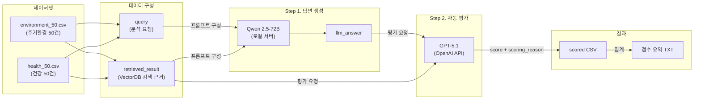
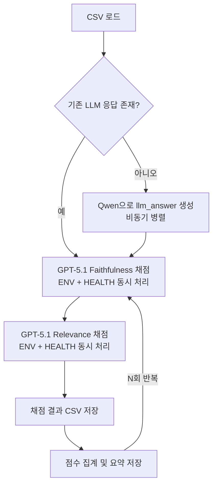

# LLM Judge Benchmark

> **LLM-as-a-Judge** 방식으로 LLM의 응답 품질을 자동 평가하는 벤치마크 파이프라인

## 프로젝트 개요

본 프로젝트는 **대상 LLM(Qwen 2.5-72B)**이 생성한 답변을 **심판 LLM(GPT-5.1)**이 자동으로 채점하는 **LLM-as-a-Judge** 평가 시스템입니다.

주거 환경(실내 온도, 습도, CO₂, VOC, PM2.5 등) 및 건강(심박수, 호흡수, 활동량) 도메인의 센서 데이터를 분석하여, Qwen이 생성한 현황 요약·권고문의 품질을 GPT가 정량적으로 평가합니다.

### 평가 지표

| 지표 | 설명 |
|------|------|
| **Faithfulness (사실충실도)** | LLM 답변이 근거 자료(`retrieved_result`)와 사실적으로 얼마나 일치하는지 (1~5점) |
| **Relevance (관련성)** | LLM 답변이 근거 자료의 핵심 초점에 얼마나 집중하는지 (1~5점) |

---

## 아키텍처



### 파이프라인 실행 흐름 (통합 버전)



---

## 디렉토리 구조

```
llm-judge-benchmark/
│
├── benchmark_pipeline_sync.py                      # 동기식 파이프라인
├── benchmark_pipeline_async.py                     # 비동기식 파이프라인
├── benchmark_pipeline_async_parallel.py            # 비동기 병렬 파이프라인 (GPT 평가만)
├── benchmark_pipeline_async_parallel_llm_answer.py # 비동기 병렬 통합 (Qwen 답변 생성 + GPT 평가)
│
├── config.yaml              # 전체 설정 (경로, 동시 호출 수, 반복 횟수 등)
├── settings.env             # API 키 및 서버 URL
├── requirements.txt         # Python 의존성
│
├── common/
│   ├── config/loader.py     # config.yaml 로딩
│   └── utils/io.py          # 텍스트 파일 로딩
│
├── gpt/
│   ├── llm_client.py        # AsyncOpenAI 클라이언트
│   └── async_scorer.py      # GPT 비동기 채점 (score_row, 병렬 처리)
│
├── qwen/
│   └── model.py             # Qwen 모델 호출 (ModelManager), 임베딩, 리랭커
│
├── calculate_function/
│   └── calculate_functions.py  # 점수 집계 (Faithfulness, Relevance)
│
├── prompt/
│   ├── system_prompt_faithfulness.txt       # GPT 심판: 사실충실도 평가 프롬프트
│   ├── system_prompt_relevance.txt          # GPT 심판: 관련성 평가 프롬프트
│   ├── user_template.txt                    # GPT 심판: 입력 템플릿
│   ├── system_prompt_qwen_environment.txt   # Qwen: 주거환경 분석 프롬프트
│   ├── system_prompt_qwen_health.txt        # Qwen: 건강 분석 프롬프트
│   ├── user_template_qwen_environment.txt   # Qwen: 주거환경 입력 템플릿
│   └── user_template_qwen_health.txt        # Qwen: 건강 입력 템플릿
│
├── data/
│   └── test_dataset/
│       ├── environment_50.csv   # 주거환경 테스트 데이터 (50건)
│       ├── health_50.csv        # 건강 테스트 데이터 (50건)
│       └── output/              # 평가 결과 저장 디렉토리
│           ├── llm_answer/      #   Qwen 응답 캐시
│           └── scores/          #   점수 요약 파일
│
└── log/                         # 실행 로그
```

---

## 설치 및 환경 설정

### 1. 의존성 설치

```bash
pip install -r requirements.txt
```

### 2. 환경 변수 설정

`settings.env` 파일에 다음 값을 설정합니다:

```env
OPENAI_KEY='your-openai-api-key'
QWEN_API='http://<qwen-server-ip>:8008/v1/chat/completions'
```

### 3. 설정 파일 (`config.yaml`)

```yaml
llm:
    max_limit_qwen: 15        # Qwen 동시 호출 수

paths:
    prompt_dir: 'prompt'
    dataset_dir: 'data/test_dataset'
    log_dir: 'log'
    output_dir_name: 'output'
    score_dir_name: 'scores'
    llm_answer_dir_name: 'llm_answer'

datasets:
    env_csv: 'environment_50.csv'
    health_csv: 'health_50.csv'

eval:
    max_limit_gpt: 25         # GPT 동시 호출 수
    repetition_num: 3         # 평가 반복 횟수

model:
    name: 'gpt-5.1'           # 심판 모델
```

---

## 실행 방법

### 권장: 비동기 병렬 통합 파이프라인

Qwen 답변 생성부터 GPT 평가까지 한 번에 실행합니다.

```bash
python benchmark_pipeline_async_parallel_llm_answer.py
```

### 기타 파이프라인

```bash
# GPT 평가만 실행 (llm_answer 컬럼이 이미 CSV에 존재하는 경우)
python benchmark_pipeline_async_parallel.py

# 비동기 단일 처리
python benchmark_pipeline_async.py

# 동기식 처리
python benchmark_pipeline_sync.py
```

### 실행 결과

실행이 완료되면 다음 파일들이 생성됩니다:

| 출력 파일 | 위치 | 설명 |
|-----------|------|------|
| `*_scored_run{i}.csv` | `data/test_dataset/output/` | 각 행에 score, scoring_reason 컬럼이 추가된 CSV |
| `*_llm_answer.csv` | `data/test_dataset/output/llm_answer/` | Qwen이 생성한 답변이 포함된 CSV (재사용 가능) |
| `faithfulness_relevance_scores{i}.txt` | `data/test_dataset/output/scores/` | 점수 집계 요약 |
| `*.log` | `log/` | 실행 로그 |

---

## 설계 시 고민했던 점

### 1. 왜 LLM-as-a-Judge인가?

사람이 직접 LLM 응답 100건을 매번 수동 평가하는 것은 시간적·비용적으로 비효율적입니다. **GPT-5.1을 심판**으로 활용하면 일관된 기준으로 대규모 평가를 자동화할 수 있습니다. 다만 심판 LLM 자체의 편향(bias)이 존재할 수 있어, 이를 보완하기 위해 **동일 데이터를 여러 번 반복 평가(`repetition_num`)** 하여 점수의 안정성을 확인합니다.

### 2. 프롬프트 엔지니어링의 핵심 고민

#### 채점 기준의 관대함 vs 엄격함

- **Faithfulness** 프롬프트는 의도적으로 **관대한 채점 기준**을 적용했습니다. LLM이 근거 자료를 약간 다른 표현으로 바꾸거나, 상식 수준의 보충 설명을 추가한 경우까지 감점하면 대부분의 답변이 3~4점에 수렴하여 변별력이 떨어지는 문제가 있었기 때문입니다.
  - `"When in doubt between two scores, choose the higher score."` → 애매한 경우 높은 점수를 선택
  - `"5 points (strongly recommended default when broadly aligned)"` → 전반적으로 일치하면 5점을 기본값으로 권장

- **Relevance** 프롬프트는 반대로 **엄격한 채점 기준**을 적용했습니다. LLM이 같은 분야의 일반적인 설명만 나열하고 검색 결과의 핵심 지표·수치에 집중하지 않는 것을 구분하기 위함입니다.
  - `"5 points should be used only in exceptional cases."` → 5점은 예외적인 경우에만 사용
  - `"if you are unsure whether the focal metrics clearly occupy a majority, choose 3 rather than 4."` → 애매하면 낮은 점수 선택

### 3. 파이프라인의 단계적 발전

프로젝트 초기에는 **동기식(sync)** 파이프라인으로 시작했지만, 100건을 순차 처리하면 GPT API 호출만으로 상당한 시간이 소요되어 단계적으로 개선했습니다:

```
sync → async → async parallel → async parallel + llm_answer 통합
```

| 단계 | 개선 내용 | 효과 |
|------|----------|------|
| **sync → async** | GPT API 비동기 호출 | 단일 요청 대기 시간 제거 |
| **async → parallel** | ENV + HEALTH 두 데이터셋 동시 평가 | 진행바 하나로 100건 한 번에 처리 |
| **+ llm_answer 통합** | Qwen 답변 생성과 GPT 평가를 하나의 파이프라인으로 | 수동 단계 제거, 전체 자동화 |

### 4. LLM 응답 캐싱

Qwen 답변 생성은 비용이 크므로, 한 번 생성된 `llm_answer`는 CSV로 캐시(`llm_answer/` 디렉토리)합니다. 이후 반복 평가(`repetition_num=3`)에서는 **같은 LLM 답변**에 대해 GPT 채점만 반복하여, 심판 LLM의 채점 일관성을 측정합니다.

### 5. 동시성 제어 (Concurrency Control)

API Rate Limit을 초과하지 않도록 `asyncio.Semaphore`로 동시 호출 수를 제한합니다:

- **Qwen**: `max_limit_qwen = 15` (로컬 서버 부하 고려)
- **GPT**: `max_limit_gpt = 25` (OpenAI Rate Limit 고려)

### 6. 점수 정규화

점수 집계에는 두 가지 방식이 존재합니다:

- **원본(Original)**: `(총점 / 문항 수) × 100` — 평균 점수를 100점 스케일로 변환 (최대 500)
- **정규화(Normalized)**: `(총점 / (문항 수 × 5)) × 100` — 백분율(0~100%)로 정규화

본 파이프라인에서는 **정규화 방식**(`original=False`)을 사용하여 0~100% 범위의 직관적인 점수를 제공합니다.

---

## 기술 스택

| 구분 | 기술 |
|------|------|
| **언어** | Python 3.10+ |
| **대상 LLM** | Qwen 2.5-72B-Instruct (로컬 vLLM 서버) |
| **심판 LLM** | GPT-5.1 (OpenAI API) |
| **비동기 처리** | asyncio, AsyncOpenAI |
| **데이터 처리** | pandas |
| **설정 관리** | PyYAML, python-dotenv |
| **진행 표시** | tqdm |

---

## 라이선스

MIT License — 자세한 내용은 [LICENSE](LICENSE) 파일을 참조하세요.
